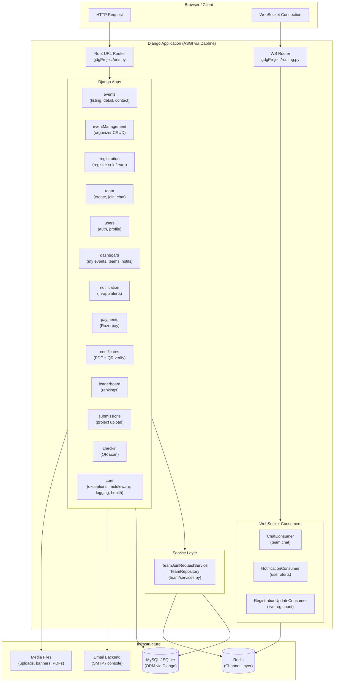
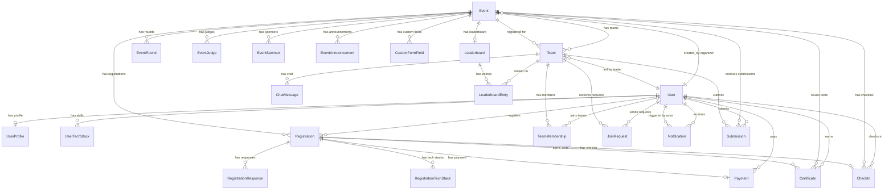
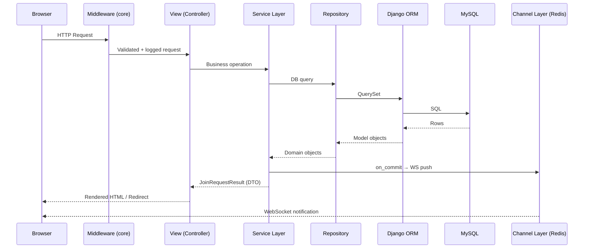
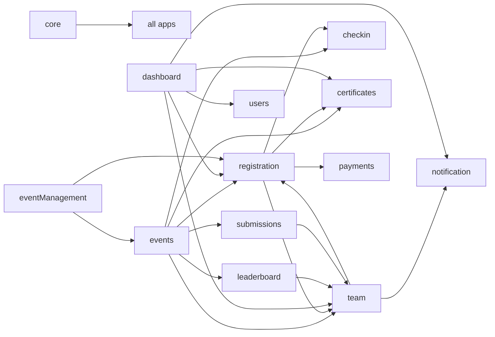

# CampusArena — College Events & Hackathon Platform

> An Unstop-style, full-stack college events management platform built with Django.  
> Discover events, form skill-matched teams, track registrations in real-time, and collaborate via in-team chat — all in one place.

---

## Table of Contents

1. [Project Overview](#1-project-overview)
2. [Architecture Diagram](#2-architecture-diagram)
3. [How Key Files Connect](#3-how-key-files-connect)
4. [All Pages & What They Do](#4-all-pages--what-they-do)
5. [App Modules](#5-app-modules)
6. [Data Models & Relationships](#6-data-models--relationships)
7. [URL Structure](#7-url-structure)
8. [WebSocket Channels](#8-websocket-channels)
9. [Service Layer Pattern](#9-service-layer-pattern)
10. [User Roles & Permissions](#10-user-roles--permissions)
11. [Tech Stack](#11-tech-stack)
12. [Project Structure](#12-project-structure)
13. [Getting Started (Local Dev)](#13-getting-started-local-dev)
14. [Environment Variables](#14-environment-variables)
15. [Running with Docker](#15-running-with-docker)
16. [Running Tests](#16-running-tests)
17. [Settings Overview](#17-settings-overview)
18. [Security](#18-security)
19. [Future Enhancements](#19-future-enhancements)

---

## 1. Project Overview

**CampusArena** is a web application for college students and faculty to:

- **Browse and discover** all college events — hackathons, workshops, coding contests, design jams, quizzes, paper presentations, and more.
- **Register** for events individually or as part of a team.
- **Form teams** with smart tech-stack matching — users specify their skills (Frontend, Backend, ML/AI, DevOps, UI/UX, Mobile, etc.) ensuring diverse skill sets.
- **Manage join requests** — team creators can approve or decline incoming requests from other students.
- **Receive real-time in-app notifications** for join requests, announcements, and reminders via WebSockets.
- **Submit projects** for hackathons and view leaderboard rankings.
- **Get certificates** (participation or merit) with QR verification.
- **Event organizers** can create, manage, and publish events with custom registration forms, multi-round timelines, prize structures, and announcements.

---

## 2. Architecture Diagram

### System Architecture



### Data Model Relationships



### Request-Response Flow



---

## 3. How Key Files Connect

This section maps every critical file to what it does and what it depends on.

```
gdgProject/
├── gdgProject/
│   ├── urls.py          ← Root router. Imports all 13 app URL modules.
│   ├── routing.py       ← WebSocket router. Wires 3 WS consumers.
│   ├── asgi.py          ← ASGI entry point. Merges HTTP + WS via Channels.
│   ├── wsgi.py          ← WSGI entry point (Gunicorn, HTTP only).
│   └── settings/
│       ├── base.py      ← Shared settings. Loads all 13 LOCAL_APPS.
│       ├── dev.py       ← SQLite, console email, verbose logs.
│       ├── prod.py      ← MySQL, Redis, SMTP, WhiteNoise, HSTS.
│       └── test.py      ← Fast hasher, in-memory SQLite.
│
├── core/
│   ├── exceptions.py    ← AppError hierarchy (NotFoundError, PermissionDeniedError,
│   │                       ValidationError, ConflictError). Used by ALL views.
│   ├── middleware/      ← ErrorHandlerMiddleware: maps AppError → JSON/HTML +
│   │                       logs all 500s with unique request_id.
│   ├── logging/         ← JSONFormatter (prod) + verbose formatter (dev).
│   └── views.py         ← /health/ endpoint.
│
├── events/
│   ├── models.py        ← Event (core entity), EventRound, EventJudge,
│   │                       EventSponsor, EventAnnouncement. Referenced by ALL apps.
│   ├── views.py         ← home(), event_detail(), event_detail_slug(),
│   │                       contact_organizer(). Reads Registration + Team data.
│   ├── urls.py          ← / (home), /events/<id>/, /events/<slug>/, /events/<id>/contact/
│   └── consumers.py     ← RegistrationUpdateConsumer (WS: live participant count).
│
├── eventManagement/
│   ├── views.py         ← organizer_dashboard(), create_event(), edit_event(),
│   │                       delete_event(), update_event_status(), create_announcement(),
│   │                       export_registrations(), clone_event(),
│   │                       update_registration_status().
│   └── urls.py          ← /organizer/...
│
├── registration/
│   ├── models.py        ← Registration (FK→Event, FK→Team, FK→User),
│   │                       CustomFormField, RegistrationResponse, RegistrationTechStack.
│   │                       CheckConstraint: type='team' requires team IS NOT NULL.
│   └── urls.py          ← /registration/...
│
├── team/
│   ├── models.py        ← Team (FK→Event, FK→User leader), TeamMembership,
│   │                       JoinRequest, ChatMessage. Soft-delete via is_deleted.
│   ├── services.py      ← TeamJoinRequestService + TeamRepository.
│   │                       All join-request logic: create/approve/decline.
│   │                       Uses transaction.atomic + transaction.on_commit for
│   │                       deferred WS pushes + notification side-effects.
│   ├── views.py         ← team_management(), create_team(), request_join(),
│   │                       leave_team(), toggle_team_status(), remove_member(),
│   │                       approve_request(), decline_request(), ai_team_matches().
│   ├── consumers.py     ← ChatConsumer (WS: real-time team chat).
│   ├── ai_matching.py   ← get_team_recommendations() — AI-powered team matching.
│   └── urls.py          ← /teams/...
│
├── users/
│   ├── models.py        ← UserProfile (OneToOne→User), UserTechStack.
│   │                       skills stored as comma-separated string.
│   └── urls.py          ← /auth/login/, /auth/register/, /auth/logout/,
│                           /auth/forgot-password/, /auth/reset-password/<uidb64>/<token>/,
│                           /auth/verify-email/, /auth/profile/edit/, /auth/change-password/
│
├── dashboard/
│   ├── views.py         ← user_dashboard(), my_profile(), my_events(), my_teams(),
│   │                       pending_requests(), notifications_view(), mark_all_read(),
│   │                       settings_view(), find_teammates(), edit_profile().
│   │                       Imports from: registration, team, notification, users, certificates.
│   └── urls.py          ← /dashboard/...
│
├── notification/
│   ├── models.py        ← Notification. GenericForeignKey (ContentType + target_id)
│   │                       so one model can point at any object (Event, Team, JoinRequest).
│   └── consumers.py     ← NotificationConsumer (WS: real-time in-app alerts).
│
├── payments/
│   └── models.py        ← Payment (OneToOne→Registration). Stores Razorpay
│                           order_id, payment_id, signature, status.
│
├── certificates/
│   └── models.py        ← Certificate (FK→Registration, FK→Event, FK→User).
│                           verification_token UUID for public verify URL.
│                           pdf_file for generated PDF.
│
├── leaderboard/
│   └── models.py        ← Leaderboard (OneToOne→Event), LeaderboardEntry
│                           (FK→Leaderboard, optional FK→Team or FK→User).
│
├── submissions/
│   └── models.py        ← Submission (FK→Event, FK→Team OR FK→User).
│                           Supports project_url, presentation_url, file_upload.
│                           UniqueConstraints: one submission per team per event,
│                           one per solo user per event.
│
├── checkin/
│   └── models.py        ← CheckIn (OneToOne→Registration, FK→Event, FK→User).
│                           UUID token embedded in QR code for scan-based check-in.
│
├── templates/           ← Global HTML templates (Django Template Language).
│   ├── base.html        ← Master layout (navbar, sidebar, messages, WS scripts).
│   ├── 404.html / 500.html
│   ├── pwa/             ← manifest.json, sw.js, offline.html (PWA support).
│   └── {app}/           ← Per-app template directories mirror app structure.
│
└── static/
    ├── css/style.css
    └── js/main.js, theme.js
```

**Dependency graph (which app imports which):**



---

## 4. All Pages & What They Do

### Public Pages (No Login Required)

| URL | View | Template | Description |
|-----|------|----------|-------------|
| `/` | `events.views.home` | `events/home.html` | Homepage with featured event carousel, filter bar (category, mode, status, search), and event card grid (24 results, sortable by newest / deadline / popular). |
| `/events/<id>/` | `events.views.event_detail` | `events/event_detail.html` | Full event detail with 7 tabs: About, Timeline/Rounds, Prizes & Certificates, Registered Participants (real-time via WS), Judges & Sponsors, FAQs, and Contact. Shows registration status, countdown timer, and "Looking for Team" section. |
| `/events/<slug>/` | `events.views.event_detail_slug` | — | Canonical slug URL. Redirects permanently to `event_detail` by PK. |
| `/offline/` | `TemplateView` | `pwa/offline.html` | PWA offline fallback page. |
| `/manifest.json` | `TemplateView` | `pwa/manifest.json` | PWA web app manifest. |
| `/sw.js` | `TemplateView` | `pwa/sw.js` | PWA service worker. |
| `/health/` | `core.views.health` | — | Container health check endpoint. Returns 200 JSON. |
| `/certificates/verify/<uuid>/` | `certificates` views | `certificates/verify.html` | Public certificate verification via UUID token. Anyone can scan the QR and verify authenticity. |

### Auth Pages (`/auth/`)

| URL | View | Description |
|-----|------|-------------|
| `/auth/login/` | `users.views.login_view` | Email + password login. Supports `?next=` redirect. "Remember Me" session control. |
| `/auth/register/` | `users.views.register_view` | Multi-field registration: name, email, phone, college, branch, year. Creates `User` + `UserProfile` atomically. |
| `/auth/logout/` | `users.views.logout_view` | Clears session and redirects to home. |
| `/auth/forgot-password/` | `users.views.forgot_password_view` | Sends password reset email with secure token link. |
| `/auth/reset-password/<uidb64>/<token>/` | `users.views.reset_password_view` | Token-validated password reset form. |
| `/auth/verify-email/` | `users.views.email_verification_view` | OTP-based email verification. |
| `/auth/profile/edit/` | `users.views.edit_profile` | Edit profile (phone, college, branch, year, bio, skills, social links, avatar). |
| `/auth/change-password/` | `users.views.change_password` | Authenticated password change. |
| `/auth/social/` | `allauth.socialaccount` | Google and GitHub OAuth callbacks. |

### Dashboard Pages (`/dashboard/`) — Login Required

| URL | View | Description |
|-----|------|-------------|
| `/dashboard/` | `user_dashboard` | Overview: 5 recent events, 5 recent teams, 5 recent notifications. |
| `/dashboard/profile/` | `my_profile` | Full profile view with stats (events joined, teams, certificates). Reads from `UserProfile` + `Certificate`. |
| `/dashboard/edit-profile/` | `edit_profile` | Edit profile form with photo upload support. |
| `/dashboard/events/` | `my_events` | All events the user has registered for, with registration status, team name, and role. |
| `/dashboard/teams/` | `my_teams` | All teams the user is part of, with co-member list and leader indicator. |
| `/dashboard/requests/` | `pending_requests` | Incoming join requests (for team leaders) and outgoing requests (sent by user). Approve/Decline actions posted to `/teams/<id>/requests/<id>/approve/`. |
| `/dashboard/find-teammates/` | `find_teammates` | Shows all `Registration` rows where `looking_for_team=True`, helping users find potential teammates across all open events. |
| `/dashboard/notifications/` | `notifications_view` | Last 30 in-app notifications with read status. |
| `/dashboard/notifications/mark-all-read/` | `mark_all_read` | POST → marks all unread notifications read. Returns JSON `{ok, updated}`. |
| `/dashboard/settings/` | `settings_view` | Basic account settings: display name and email. |

### Team Pages (`/teams/`) — Login Required

| URL | View | Description |
|-----|------|-------------|
| `/teams/<id>/` | `team_management` | Team workspace: member list with roles, tech stack coverage indicator, pending join requests (leader only), chat history (last 50 messages), suggested members (AI-ranked). POST actions: `send_message`, `approve_request`, `decline_request`. |
| `/teams/create/<event_id>/` | `create_team` | POST only. Creates a `Team` + initial `TeamMembership` for the creator. Redirects to team workspace. |
| `/teams/join/<team_id>/` | `request_join` | POST only. Delegates to `TeamJoinRequestService.create_join_request()`. Validates: team is open, event registration is open, user not already in a team for this event, team not full. |
| `/teams/<id>/leave/` | `leave_team` | POST only. Removes `TeamMembership`. Auto-reopens team if it was closed and now has spots. |
| `/teams/<id>/toggle-status/` | `toggle_team_status` | POST only. Leader toggles team between Open / Closed. |
| `/teams/<id>/remove/<user_id>/` | `remove_member` | POST only. Leader removes a specific member. |
| `/teams/<id>/requests/<req_id>/approve/` | `approve_request` | POST. Leader approves join request via `TeamJoinRequestService.approve_request()`. Atomic: updates request status + creates `TeamMembership` + creates/confirms `Registration` + auto-closes team if now full + pushes WS notification. |
| `/teams/<id>/requests/<req_id>/decline/` | `decline_request` | POST. Leader declines request. Updates status, sends notification. |
| `/teams/match/<event_id>/` | `ai_team_matches` | GET. Calls `team.ai_matching.get_team_recommendations()` to suggest top 10 matching teams for the current user. |
| `/teams/find/` | `find_teammates` | Redirects to `/dashboard/find-teammates/`. |

### Event Registration Pages (`/registration/`)

| URL | Description |
|-----|-------------|
| `/registration/` and sub-paths | Handles all event registration flows: solo registration, create-a-team registration, join-team registration. Renders step-form with custom fields defined by organizer (`CustomFormField`). On submit, creates `Registration` + `RegistrationTechStack` rows. For paid events, initiates Razorpay payment flow. |

### Organizer Pages (`/organizer/`) — Organizer Role Required

| URL | View | Description |
|-----|------|-------------|
| `/organizer/` | `organizer_dashboard` | Organizer's hub: list of their events with registration counts, status badges, quick actions. |
| `/organizer/create/` | `create_event` | Multi-step event creation wizard: basic info, dates, team settings, prizes, certificates, custom form builder. |
| `/organizer/<id>/edit/` | `edit_event` | Edit all event fields. Restricted once event is ongoing. |
| `/organizer/<id>/delete/` | `delete_event` | Soft-deletes event (`is_deleted=True`). Data preserved. |
| `/organizer/<id>/status/` | `update_event_status` | Advance event through status state machine: draft → published → registration_open → registration_closed → ongoing → completed. |
| `/organizer/<id>/announce/` | `create_announcement` | Post an `EventAnnouncement` to all registrants. |
| `/organizer/<id>/export/` | `export_registrations` | Export all registrations to CSV/Excel. |
| `/organizer/<id>/clone/` | `clone_event` | Duplicate an event as a new draft. |
| `/organizer/registration/<reg_id>/status/` | `update_registration_status` | Approve or reject a pending registration (when moderation is enabled). |

### Feature-Specific Pages

| App | URL Prefix | Key Pages |
|-----|-----------|-----------|
| **payments** | `/payments/` | Razorpay order creation, payment callback verification, payment status. |
| **certificates** | `/certificates/` | Certificate list for a user, PDF download, public verification at `/certificates/verify/<uuid>/`. |
| **leaderboard** | `/leaderboard/` | Per-event public/private leaderboard with rank, score, team/user. Organizer can update entries. |
| **submissions** | `/submissions/` | Submit project (title, description, GitHub URL, slides URL, file upload). Edit draft, finalize submission, organizer review/scoring. |
| **checkin** | `/checkin/` | Generate QR code per registration, organizer scan interface at `/checkin/scan/<token>/` marks participant as checked in. |

### Admin

| URL | Description |
|-----|-------------|
| `/admin/` | Django Admin. Super admin access to all models: Events, Registrations, Teams, Users, Notifications, Payments, Certificates, Leaderboards, Submissions, Check-ins. |

---

## 5. App Modules

The project has **13 Django apps**, each with a single responsibility:

| App | Responsibility |
|-----|---------------|
| `core` | Shared infrastructure: `AppError` exception hierarchy, `ErrorHandlerMiddleware`, JSON/verbose log formatters, `/health/` endpoint. |
| `events` | Public event browsing, listing, detail view, organizer contact. Core `Event` model is the central entity for the entire platform. |
| `eventManagement` | Organizer-facing event lifecycle: create, edit, publish, manage rounds, send announcements, export data, clone events. |
| `registration` | Records user participation (solo or team). Handles custom form fields defined by organizers and per-registration tech stack selection. |
| `team` | Team creation, membership, join request workflow (service layer), in-team chat, AI-powered team matching suggestions. |
| `users` | Authentication (email + password + OAuth via allauth). `UserProfile` (1:1 extension of Django User) and `UserTechStack` models. |
| `dashboard` | Authenticated user's personal hub. Aggregates data from registration, team, notification, users, and certificates into a single interface. |
| `notification` | Generic in-app notification model using Django's ContentType framework. Receives pushes from `team/services.py` via `transaction.on_commit`. |
| `payments` | Razorpay integration. One `Payment` record per `Registration` for paid events. Tracks order ID, payment ID, signature, and status. |
| `certificates` | PDF certificate generation with UUID-based public verification. Tied to `Registration` + `Event`. |
| `leaderboard` | Per-event `Leaderboard` with ranked `LeaderboardEntry` rows (team or individual). Organizer-controlled visibility. |
| `submissions` | Project submission for hackathons — URL, file, and description. One submission per team (or solo user) per event. Organizer scoring and review. |
| `checkin` | QR code-based check-in system. UUID token per registration, scan to mark as checked in. |

---

## 6. Data Models & Relationships

### Core Entity: `Event` (`events/models.py`)

The `Event` model is the central entity. **Every other app has a FK or relation pointing to it.**

**Status state machine:**
```
draft → published → registration_open → registration_closed → ongoing → completed
      ↘ cancelled (from any mutable state)
      ↘ archived  (soft-delete)
```

**Key fields:** `slug` (unique URL key), `category`, `mode`, `participation_type`, `status`, `registration_start/end`, `event_start/end`, `capacity`, `min/max_team_size`, `prize_pool`, `registration_fee`, `participation_certificate`, `merit_certificate`, `is_featured`, `created_by` (FK→User), `is_deleted` (soft-delete).

**Custom managers:**
- `Event.objects` — `ActiveEventManager` (excludes `is_deleted=True`) — the **default**
- `Event.all_objects` — `AllEventManager` (includes soft-deleted, admin use only)

**DB-level safety:** 4 `CheckConstraints` (date ordering, team size ordering, capacity ≥ 1) and compound indexes for common query patterns.

### `UserProfile` (`users/models.py`)

One-to-one extension of Django's `auth.User`. Stores: `phone`, `college`, `branch`, `year`, `bio`, `profile_picture`, `github`, `linkedin`, `portfolio`, `skills` (comma-separated), `email_verified`.

Properties: `skills_list` (Python list), `year_display` ("2nd Year").

### `Team` (`team/models.py`)

| Field | Notes |
|-------|-------|
| `event` | FK → Event |
| `name` | Unique per event |
| `leader` | FK → User (PROTECT; unique per event via DB constraint) |
| `status` | open / closed / disbanded |
| `is_deleted` | Soft-delete flag |

Properties: `member_count`, `is_full`, `spots_available`. Custom managers mirror the `Event` pattern.

### `Registration` (`registration/models.py`)

| Field | Notes |
|-------|-------|
| `registration_id` | Auto-generated UUID-based readable ID (e.g., `REG-A1B2C3D4`) |
| `event` | FK → Event |
| `user` | FK → User |
| `type` | individual / team |
| `team` | FK → Team (nullable; required when `type=team` via DB CheckConstraint) |
| `status` | pending → confirmed → cancelled / submitted |
| `looking_for_team` | Flag — shows user in "Looking for Team" list |
| `preferred_role` | Role the user wants in a team |

Related: `RegistrationTechStack` (per-event skills), `RegistrationResponse` (answers to custom form fields).

### `JoinRequest` (`team/models.py`)

State machine: `pending → approved | declined | cancelled`

DB constraint: unique pending request per (team, user). Business logic lives in `TeamJoinRequestService`, not the model.

### `Notification` (`notification/models.py`)

Generic notification using Django's `ContentType` framework: `target_ct` + `target_id` + `target` (GenericForeignKey) lets one notification model point at any object (Event, Team, JoinRequest, etc.). Indexed on `(user, -created_at)` and `(user, read)`.

### New Feature Models

| Model | Key Relation |
|-------|-------------|
| `Payment` | OneToOne → Registration; stores Razorpay IDs |
| `Certificate` | FK → Registration + Event + User; UUID `verification_token` |
| `Leaderboard` | OneToOne → Event; child `LeaderboardEntry` rows |
| `LeaderboardEntry` | FK → Leaderboard; optional FK → Team or User |
| `Submission` | FK → Event + (Team or User); unique per team-event and per solo-user-event |
| `CheckIn` | OneToOne → Registration; UUID `token` for QR scan |

---

## 7. URL Structure

### HTTP URLs (`gdgProject/urls.py`)

| Prefix | App Namespace | Mounted App |
|--------|--------------|-------------|
| `/` | `events` | Event listing + detail |
| `/auth/` | `users` | Login, register, logout, profile |
| `/auth/social/` | `allauth` | Google + GitHub OAuth |
| `/dashboard/` | `dashboard` | User dashboard |
| `/teams/` | `team` | Team management |
| `/organizer/` | `eventManagement` | Organizer tools |
| `/registration/` | `registration` | Event registration |
| `/notifications/` | `notification` | Notification list |
| `/payments/` | `payments` | Razorpay flow |
| `/certificates/` | `certificates` | PDF download + verify |
| `/leaderboard/` | `leaderboard` | Rankings |
| `/submissions/` | `submissions` | Project submission |
| `/checkin/` | `checkin` | QR check-in |
| `/admin/` | Django admin | Super admin |
| `/health/` | `core` | Health check |
| `/manifest.json`, `/sw.js`, `/offline/` | PWA | PWA assets |

### WebSocket URLs (`gdgProject/routing.py`)

| WS Path | Consumer | Purpose |
|---------|----------|---------|
| `ws/team/<team_id>/chat/` | `team.consumers.ChatConsumer` | Real-time team chat |
| `ws/user/notifications/` | `notification.consumers.NotificationConsumer` | Real-time in-app alerts |
| `ws/event/<event_id>/registrations/` | `events.consumers.RegistrationUpdateConsumer` | Live participant count |

---

## 8. WebSocket Channels

**Technology:** Django Channels (ASGI) + Channel Layer (Redis in prod, in-memory in dev)

### How WS pushes work end-to-end

1. A user action (e.g., join request approved) triggers a view.
2. The view delegates to `TeamJoinRequestService.approve_request()`.
3. The service wraps everything in `@transaction.atomic`.
4. After the DB commit succeeds, `transaction.on_commit()` fires `_push_ws_notification()`.
5. `_push_ws_notification()` calls `async_to_sync(channel_layer.group_send)` to push to the recipient's `user_<id>_notifications` group.
6. The connected `NotificationConsumer` receives the event and forwards it to the browser.

### Channel Groups

| Group | When created | Who listens |
|-------|-------------|-------------|
| `user_{userId}_notifications` | On WS connect to `/ws/user/notifications/` | User's notification bell |
| `team_{teamId}_chat` | On WS connect to `/ws/team/<id>/chat/` | Team members in the chat |
| `event_{eventId}_registrations` | On WS connect to `/ws/event/<id>/registrations/` | Event detail page visitors |

---

## 9. Service Layer Pattern

`team/services.py` implements a clean **Controller → Service → Repository → Model** pattern:

```python
# Controller (view) — just calls the service
result = TeamJoinRequestService().approve_request(
    team_id=team_id,
    requester_user_id=join_req.user_id,
    approver=request.user,
)

# Service — all business logic, wrapped in atomic transaction
@transaction.atomic
def approve_request(self, *, team_id, requester_user_id, approver):
    team = self.repo.get_team_with_event(team_id)      # Repository call
    # ... permission checks, validations ...
    self.repo.create_membership(team, user, role, skills)  # Repository call
    Registration.objects.get_or_create(...)             # Side-effect: create registration
    transaction.on_commit(lambda: _push_ws_notification(...))  # Deferred WS push
    return JoinRequestResult(...)                       # DTO — not a model instance

# Repository — isolated DB access
class TeamRepository:
    @staticmethod
    def get_team_with_event(team_id: int):
        return Team.objects.select_related("event", "leader").get(id=team_id)
```

**Key patterns:**

| Pattern | Implementation |
|---------|---------------|
| Service Layer | `TeamJoinRequestService` — all join-request business logic |
| Repository | `TeamRepository` — all DB queries for the team domain |
| DTO (Data Transfer Object) | `JoinRequestResult` frozen dataclass — service returns this, not raw models |
| Structured Exceptions | `AppError` hierarchy from `core/exceptions.py` — propagated through all layers |
| Deferred side-effects | `transaction.on_commit()` — notifications + WS pushes only fire after DB commits |
| Soft Delete | `is_deleted` flag + custom managers on `Event` and `Team` |
| Global Error Handling | `core/middleware/ErrorHandlerMiddleware` maps `AppError` → HTTP status codes |

---

## 10. User Roles & Permissions

| Role | Access |
|------|--------|
| **Super Admin** | Full platform control — all events, users, settings, analytics via `/admin/`. |
| **Event Organizer** | Create & manage own events, custom form builder, view registrations, send announcements, approve/reject registrations, export data. Access via `/organizer/`. |
| **Participant** | Browse events, register (solo or team), create teams, send/accept join requests, in-team chat, personal dashboard, submit projects. |
| **Guest (Visitor)** | Read-only event browsing. Must log in to register or interact with teams. |

Role enforcement is done via Django's `@login_required` decorator and permission checks inside views/services (e.g., `team.leader_id == request.user.id`).

---

## 11. Tech Stack

| Layer | Technology |
|-------|-----------|
| **Framework** | Django 6.x (Python 3.12) |
| **Real-time** | Django Channels (ASGI) + WebSockets |
| **Database (dev)** | SQLite (via `settings/dev.py`) |
| **Database (prod)** | MySQL 8.0+ (via `settings/prod.py`) |
| **Channel Layer (dev)** | In-memory (`channels.layers.InMemoryChannelLayer`) |
| **Channel Layer (prod)** | Redis 7 (`channels_redis`) |
| **Auth** | Django built-in + `django-allauth` (Google + GitHub OAuth) |
| **Config** | `python-decouple` (`.env` files) |
| **Filtering** | `django-filter` |
| **Image Handling** | Pillow |
| **Containerisation** | Docker (multi-stage), Docker Compose |
| **WSGI Server** | Gunicorn (HTTP) |
| **ASGI Server** | Daphne (WebSockets + HTTP) |
| **Payments** | Razorpay |
| **Testing** | pytest-django, coverage, factory-boy |
| **Linting** | Ruff, Black, isort |
| **Security Scanning** | Bandit, Safety |

---

## 12. Project Structure

```
GDG_team/
├── Dockerfile                  # Multi-stage production Docker image
├── docker-compose.yml          # Django + MySQL + Redis stack
├── requirements.txt            # Python dependencies
├── pyproject.toml              # Ruff, Black, isort config
├── .env.example                # Template for environment variables
├── PROJECT_SPECIFICATION.txt   # Full feature & design specification
└── gdgProject/                 # Django project root
    ├── manage.py
    ├── core/                   # Shared infrastructure
    │   ├── exceptions.py       # AppError → NotFoundError, PermissionDeniedError,
    │   │                       #   ValidationError, ConflictError
    │   ├── views.py            # /health/ endpoint
    │   ├── middleware/         # ErrorHandlerMiddleware
    │   └── logging/            # JSONFormatter + verbose formatters
    │
    ├── events/                 # Public event browsing
    │   ├── models.py           # Event, EventRound, EventJudge, EventSponsor,
    │   │                       #   EventAnnouncement
    │   ├── views.py            # home, event_detail, contact_organizer
    │   ├── urls.py
    │   └── consumers.py        # RegistrationUpdateConsumer (WS)
    │
    ├── eventManagement/        # Organizer event tools
    │   ├── views.py            # CRUD + status transitions + export
    │   └── urls.py
    │
    ├── registration/           # Event registration
    │   ├── models.py           # Registration, CustomFormField,
    │   │                       #   RegistrationResponse, RegistrationTechStack
    │   └── urls.py
    │
    ├── team/                   # Team lifecycle
    │   ├── models.py           # Team, TeamMembership, JoinRequest, ChatMessage
    │   ├── services.py         # TeamJoinRequestService + TeamRepository
    │   ├── ai_matching.py      # get_team_recommendations()
    │   ├── views.py
    │   ├── consumers.py        # ChatConsumer (WS)
    │   └── urls.py
    │
    ├── users/                  # Authentication + profiles
    │   ├── models.py           # UserProfile, UserTechStack
    │   └── urls.py
    │
    ├── dashboard/              # Authenticated user hub
    │   ├── views.py            # Aggregates registration, team, notif, certs
    │   └── urls.py
    │
    ├── notification/           # In-app notifications
    │   ├── models.py           # Notification (GenericForeignKey)
    │   ├── consumers.py        # NotificationConsumer (WS)
    │   └── urls.py
    │
    ├── payments/               # Razorpay integration
    │   ├── models.py           # Payment
    │   └── urls.py
    │
    ├── certificates/           # PDF certificates + verification
    │   ├── models.py           # Certificate (UUID token)
    │   └── urls.py
    │
    ├── leaderboard/            # Event rankings
    │   ├── models.py           # Leaderboard, LeaderboardEntry
    │   └── urls.py
    │
    ├── submissions/            # Project submission
    │   ├── models.py           # Submission
    │   └── urls.py
    │
    ├── checkin/                # QR check-in
    │   ├── models.py           # CheckIn (UUID token)
    │   └── urls.py
    │
    ├── templates/              # Global HTML templates
    │   ├── base.html           # Master layout
    │   ├── 404.html / 500.html
    │   ├── pwa/                # PWA assets (manifest, sw.js, offline)
    │   └── {app}/              # Per-app template directories
    │
    ├── static/
    │   ├── css/style.css
    │   └── js/main.js, theme.js
    │
    └── gdgProject/             # Django config package
        ├── urls.py             # Root HTTP URL router (13 apps)
        ├── routing.py          # Root WebSocket router (3 consumers)
        ├── asgi.py             # ASGI entry (HTTP + WS via Channels)
        ├── wsgi.py             # WSGI entry (Gunicorn, HTTP only)
        └── settings/
            ├── base.py         # Shared: apps, middleware, templates, auth
            ├── dev.py          # SQLite, console email, verbose logging
            ├── prod.py         # MySQL, Redis, SMTP, WhiteNoise, HSTS
            └── test.py         # Fast hasher, in-memory SQLite
```

---

## 13. Getting Started (Local Dev)

### Prerequisites

- Python 3.12+
- Git

### Setup

```bash
# 1. Clone the repository
git clone <repo-url>
cd GDG_team

# 2. Create and activate a virtual environment
python -m venv env
source env/bin/activate       # Linux / macOS
env\Scripts\activate          # Windows

# 3. Install dependencies
pip install -r requirements.txt

# 4. Create a .env file
cp .env.example .env
# Edit .env — see Environment Variables section below

# 5. Run database migrations
cd gdgProject
python manage.py migrate --settings=gdgProject.settings.dev

# 6. Create a superuser
python manage.py createsuperuser --settings=gdgProject.settings.dev

# 7. Start the development server
python manage.py runserver --settings=gdgProject.settings.dev
```

App is available at `http://localhost:8000`.

For WebSocket support in development, use Daphne instead of `runserver`:

```bash
daphne -b 0.0.0.0 -p 8000 gdgProject.asgi:application
```

---

## 14. Environment Variables

Create `.env` inside `gdgProject/` (or project root). Minimum for development:

```env
DJANGO_SETTINGS_MODULE=gdgProject.settings.dev
SECRET_KEY=your-dev-secret-key-change-me
DEBUG=True
ALLOWED_HOSTS=localhost,127.0.0.1

# Dev uses SQLite by default — no DB vars needed.
# For MySQL:
# DB_ENGINE=django.db.backends.mysql
# DB_NAME=campusarena
# DB_USER=campusarena
# DB_PASSWORD=changeme
# DB_HOST=127.0.0.1
# DB_PORT=3306
```

Additional variables for **production**:

```env
DJANGO_SETTINGS_MODULE=gdgProject.settings.prod
DEBUG=False
SECRET_KEY=<strong-random-key>
ALLOWED_HOSTS=yourdomain.com

DB_ENGINE=django.db.backends.mysql
DB_NAME=campusarena
DB_USER=campusarena
DB_PASSWORD=<strong-password>
DB_HOST=db
DB_PORT=3306

REDIS_URL=redis://redis:6379/0
CACHE_BACKEND=django.core.cache.backends.redis.RedisCache
CACHE_LOCATION=redis://redis:6379/1

EMAIL_BACKEND=django.core.mail.backends.smtp.EmailBackend
EMAIL_HOST=smtp.gmail.com
EMAIL_PORT=587
EMAIL_HOST_USER=your@email.com
EMAIL_HOST_PASSWORD=your-app-password
DEFAULT_FROM_EMAIL=noreply@campusarena.dev

RAZORPAY_KEY_ID=rzp_live_...
RAZORPAY_KEY_SECRET=...

SITE_URL=https://yourdomain.com

GOOGLE_CLIENT_ID=...
GOOGLE_CLIENT_SECRET=...
GITHUB_CLIENT_ID=...
GITHUB_CLIENT_SECRET=...
```

---

## 15. Running with Docker

The `docker-compose.yml` spins up three services: **Django** (Daphne ASGI), **MySQL**, and **Redis**.

```bash
# Build and start all services
docker compose up --build

# Run migrations
docker compose exec web python manage.py migrate

# Create a superuser
docker compose exec web python manage.py createsuperuser

# Stop all services
docker compose down

# Stop and remove volumes (clears all DB data)
docker compose down -v
```

App available at `http://localhost:8000`.

**Docker image details:**
- Multi-stage build (`builder → runtime`) using `python:3.12-slim`
- Static files collected at build time via `collectstatic`
- Runs as a non-root `app` user for security
- MySQL healthcheck ensures DB is ready before the web container starts

---

## 16. Running Tests

```bash
cd gdgProject

# Run all tests
pytest --ds=gdgProject.settings.test

# Run with coverage report
coverage run -m pytest --ds=gdgProject.settings.test
coverage report

# Run a specific file
pytest core/tests/test_baseline.py --ds=gdgProject.settings.test -v
```

### Test Strategy — Three-Archetype Pyramid

| Type | Example | Description |
|------|---------|-------------|
| **Unit** | `TestTeamJoinRequestServiceUnit` | Service layer in complete isolation using mocks — zero DB, fastest execution. |
| **Integration** | Views in `test_baseline.py` | Views + DB wired together using Django's `TestCase` with a real test database. |
| **Permission** | Role tests in `test_baseline.py` | Validates RBAC — unauthenticated, wrong-role, and correct-role scenarios across all protected endpoints. |

---

## 17. Settings Overview

| Module | Environment | Key overrides |
|--------|-------------|--------------|
| `settings/base.py` | All | Installed apps, middleware, templates, password validators, allauth config, logging formatters, Razorpay keys. |
| `settings/dev.py` | Local development | SQLite database, console email backend, in-memory cache, in-memory channel layer, verbose logging, CSRF relaxation. |
| `settings/prod.py` | Production | MySQL, Redis cache + channel layer, SMTP email, HSTS, secure cookies, SSL redirect, WhiteNoise static files, JSON logging. |
| `settings/test.py` | pytest | Fast MD5 password hasher, in-memory SQLite, `EMAIL_BACKEND=console`. |

Switch via `DJANGO_SETTINGS_MODULE` environment variable.

---

## 18. Security

- **`DEBUG=False`** enforced in `settings/prod.py`
- **HSTS** — 1-year max-age, subdomains included, preload flag set
- **Secure cookies** — `SESSION_COOKIE_SECURE`, `CSRF_COOKIE_SECURE`, `HTTPONLY` flags
- **SSL redirect** — `SECURE_SSL_REDIRECT=True` in production
- **Content security** — `SECURE_CONTENT_TYPE_NOSNIFF`, `SECURE_BROWSER_XSS_FILTER`
- **CSRF protection** — Django's built-in `CsrfViewMiddleware` active on all POST/PUT/DELETE
- **Non-root Docker user** — container runs as `app` system user
- **Password validation** — minimum 10 chars, common password list check, numeric-only check
- **DB-level constraints** — `UniqueConstraint` and `CheckConstraint` on all critical business rules (team registration requires a team FK, date ordering, capacity bounds)
- **Atomic requests** — `ATOMIC_REQUESTS=True` wraps every HTTP request in a DB transaction
- **Soft delete** — `Event` and `Team` are never hard-deleted by default; data preserved
- **Structured exceptions** — `AppError` hierarchy prevents raw exceptions leaking to users
- **Service-layer permission checks** — role checks in `TeamJoinRequestService` before any mutation
- **Dependency scanning** — `bandit` (SAST) + `safety` (CVE checks) in dev toolchain
- **OAuth** — Google and GitHub via `django-allauth` with server-side token verification

---

## 19. Future Enhancements

These items are planned or partially implemented. See `PROJECT_SPECIFICATION.txt` for full details.

| Enhancement | Notes |
|-------------|-------|
| Real-time in-team chat (WebSocket upgrade) | `ChatConsumer` exists; upgrade HTTP-POST chat to full WS streaming |
| Custom registration form builder UI | `CustomFormField` model exists; drag-and-drop organizer UI pending |
| Email verification on registration | OTP infrastructure in settings (`OTP_EXPIRY_SECONDS=600`); UI pending |
| Smart team matching (AI) | `team/ai_matching.py` scaffolded; scoring algorithm to be enhanced |
| Celery + Redis task queue | Async email sending, scheduled status transitions, event reminders |
| Full REST API (DRF) | For mobile/SPA clients |
| Analytics dashboard | Registration trends, skill distribution, team breakdown charts |
| Multi-round progression | Organizer-controlled round advancement with elimination tracking |
| Full-text event search | PostgreSQL `tsvector` or Elasticsearch |
| WhatsApp/Telegram bot | Event reminders via bot integration |
| Calendar export | `.ics` file download for registered events |
| Dark / Light theme | Theme toggle in settings (partial CSS variables already in place) |
| Multi-language support | Django i18n (`gettext_lazy` already used throughout models) |
